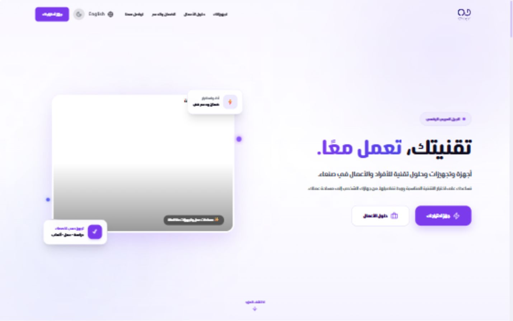
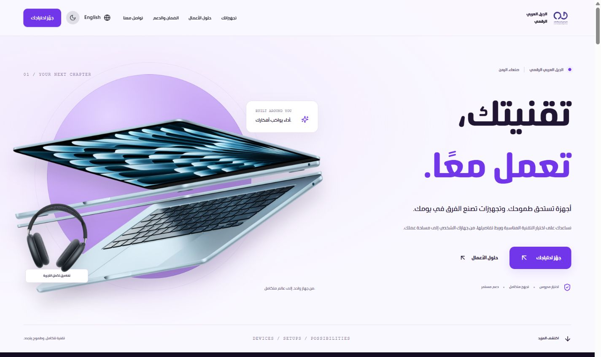
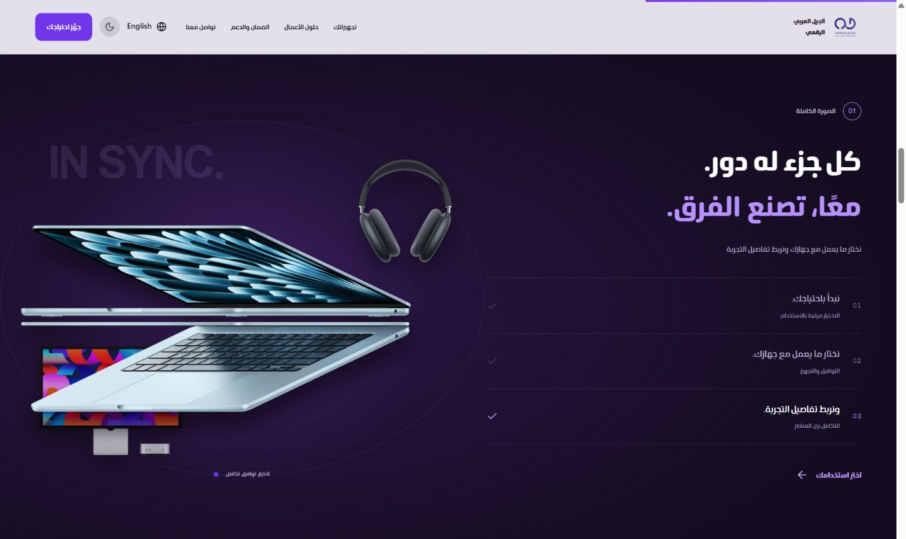
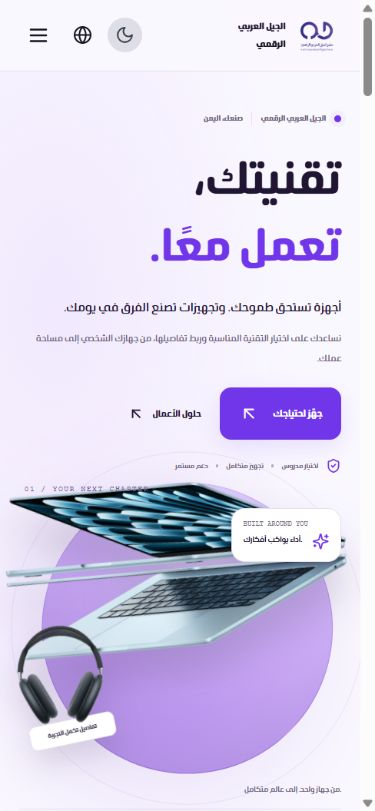
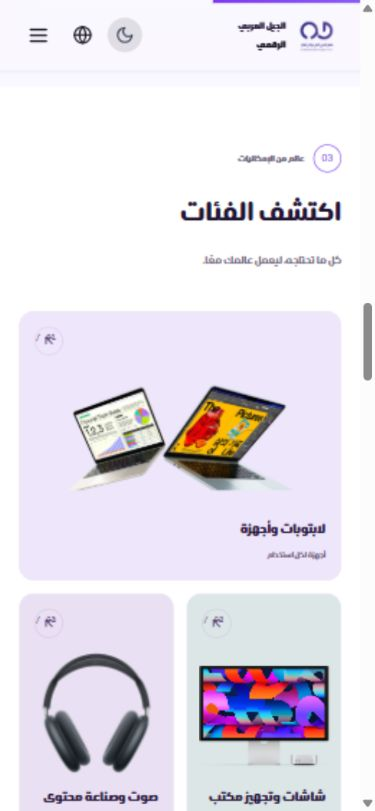
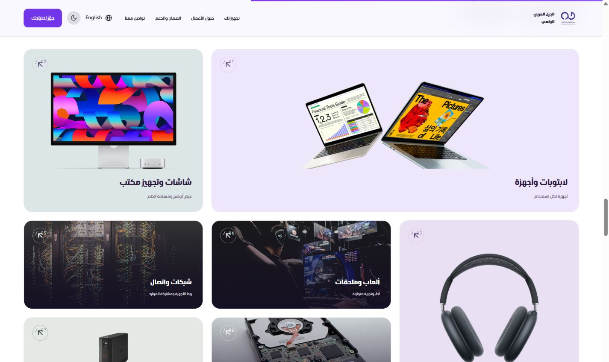
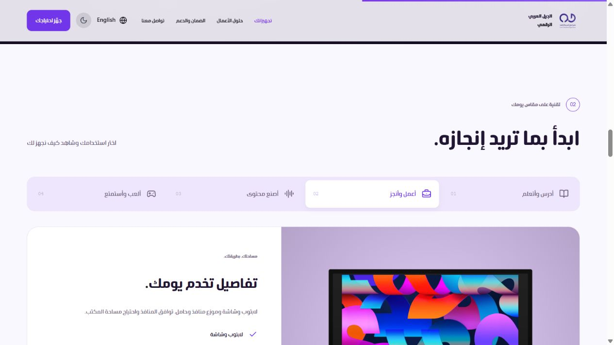
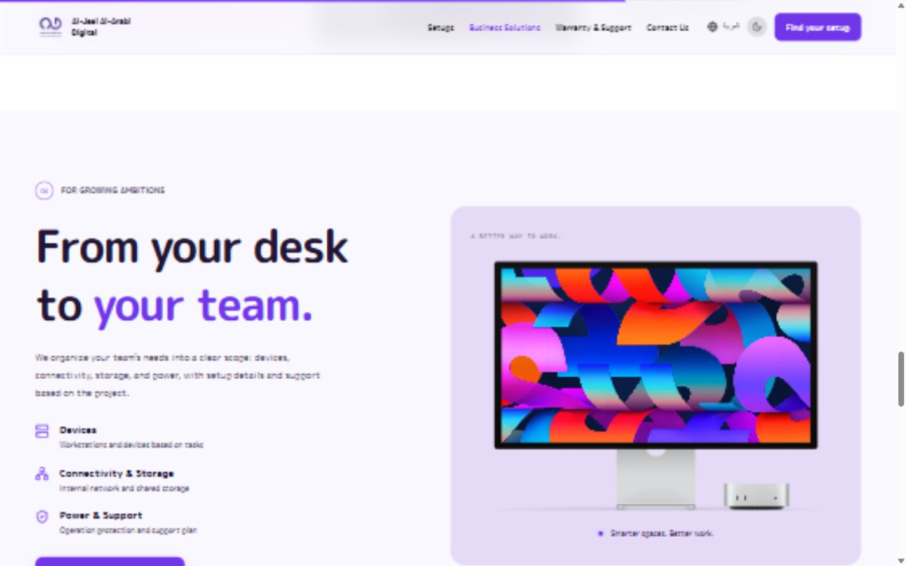
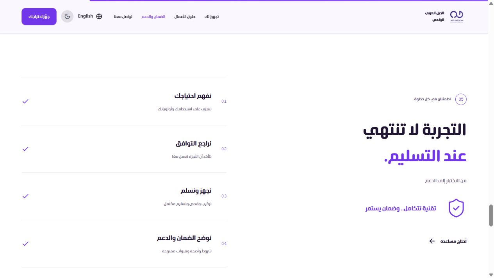
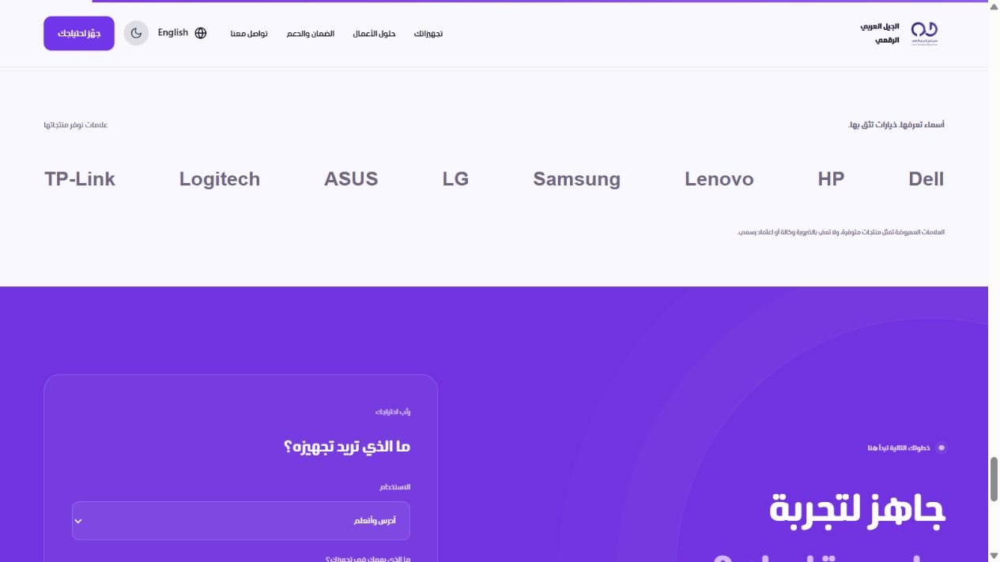

# المراجعة البصرية — 2 أكتوبر 2026

تم الفحص داخل متصفح Codex الفعلي، قبل التعديل وبعده، ثم على نسخة الإنتاج المبنية بـ Vite.

## التشخيص قبل التنفيذ

1. البداية: صورة رئيسية غير محملة وإطار كبير فارغ؛ التكوين لا يبرز المنتج. ضعف واضح.
2. التجهيزات: لوحة الدراسة تظهر بإطار صورة فارغ، وتكرار البطاقات يضعف التسلسل. احتاجت إعادة تنظيم.
3. الإنجليزية: تقسيم عنوان البداية بعلامة الفاصلة العربية يفقد جزءًا من العنوان الإنجليزي. خلل مؤكد من الكود، وصُحح واختُبر.
4. التفاعل: روابط `#contact?interest=...` لا تصل إلى عنصر الاتصال، وأزرار الختام تعود إلى القسم نفسه دون خطوة تالية. صُححت واختُبرت باختيار التجهيز والفئة ونسخ الملخص.

## رحلة الموقع بعد التنفيذ

| الخطوة | الشاشة | الحالة بعد المراجعة |
|---|---|---|
| 1 | البداية | صور منتجات محلية واضحة، عنوان كبير وتكوين بنفسجي؛ سليم على الكمبيوتر والجوال |
| 2 | التكامل | مشهد مثبت يتطور مع التمرير على الكمبيوتر؛ يخرج طبيعيًا إلى القسم التالي، ولا يُثبّت على الجوال |
| 3 | التجهيزات | أربع تبويبات، صور ونصوص تتغير مع الاختيار؛ تم اختبار الدراسة والعمل والمحتوى والألعاب |
| 4 | الفئات | تكوين متنوع وصور واضحة؛ اختيار الفئة يصل إلى الملخص، وصورة الطاقة أصبحت UPS فعلية |
| 5 | الأعمال | شاشة حقيقية بتكوين واضح، عناصر نطاق الخدمة ومسار تجهيز متدرج؛ تمت المراجعة البصرية |
| 6 | الدعم | ترتيب أبسط دون بطاقات متكررة، وصف واضح لخطوات الخدمة؛ تمت المراجعة البصرية |
| 7 | العلامات | أسماء مقروءة دون الاعتماد على صور الشعارات الخارجية التي لم تُحمّل، مع توضيح طبيعة العلاقة |
| 8 | التواصل والتذييل | اختيار الاستخدام والتفاصيل ونسخ ملخص محلي؛ حوار المعلومات يعمل ويُغلق بـ Escape |

## ما اختُبر فعلًا

- مقاسات المتصفح: 1440×900 و768×1024 و390×844 و360×800. المقاسات تحاكي شاشات الأجهزة؛ لم يُجرَ اختبار على هاتف فعلي.
- العربية والإنجليزية، واتجاها RTL وLTR، مع تغير ترتيب التنقل والمحتوى واتجاه الأسهم.
- الوضع الفاتح والداكن، والتنقل بالقائمة على الجوال، والإغلاق بعد اختيار رابط.
- تغير عناصر مشهد التكامل وتحديد مرحلته أثناء التمرير، والخروج من المشهد المثبت.
- تبديل التبويبات، انتقال اختيار الألعاب إلى `gaming`، وانتقال فئة الألعاب إلى `category-gaming` دون تعارض.
- نسخ ملخص احتياج تجريبي والتحقق من النص داخل الحافظة.
- فتح حوار معلومات الموقع وإغلاقه بلوحة المفاتيح.
- فحص عرض المستند: لا تجاوز أفقي في المقاسات التي جرى فحصها.
- فحص الصور: لم يظهر رابط صورة محملة فاشلة في النسخة النهائية.
- سجل جلسة إنتاج نظيفة: لا أخطاء أو تحذيرات في المتصفح خلال الفحص.
- `npm run build`: اجتاز TypeScript وبناء Vite بنجاح.

## الحركة والتحميل

استُخدمت GSAP وLenis وRadix الموجودة، دون إضافة اعتماد جديد. الصور WebP ومحلية، وتحميل بقية الصور كسول. أزيل تحميل Framer Motion من شريط التقدم، وصُححت إزالة دالة GSAP ticker عند تنظيف Lenis. فُصلت حركة دخول المنتج عن حركته أثناء التمرير لمنع تغير موضعه عند العودة للبداية. حركات النص تُطبق على كتل كاملة للحفاظ على اتصال حروف العربية. توجد استجابة لإعداد تقليل الحركة في النظام؛ لم يُجرَ تغيير إعداد النظام في الاختبار. لم تُقَس Core Web Vitals أو الأداء على شبكة جوال فعلية.

## حدود الوظيفة

الملخص يُنسخ محليًا ولا يُرسل إلى جهة خارجية. ربط WhatsApp أو نموذج إرسال يحتاج بيانات التواصل الفعلية للمحل. صور المنتجات توضيحية؛ التوفر والأسعار والضمان لم تُتحقق من مخزون المحل. روابط مصادر الصور موثقة في `public/images/sources.json`.

## اللقطات

